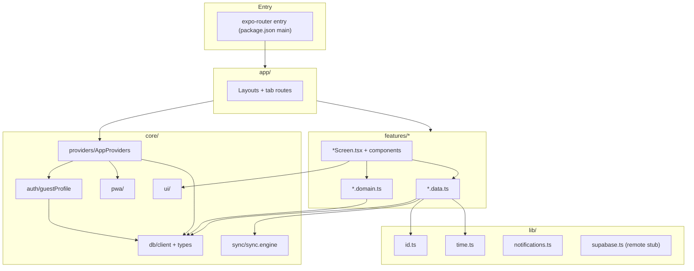

# 00_INDEX.md

**Knowledge-base location:** generated section files live under `docs/knowledge-base/` in this repository. **Master summary:** [KNOWLEDGE_BASE.md](./KNOWLEDGE_BASE.md).

## Repositories / modules (full inventory)

**Repository:** `superhabits` — single npm/Expo app package (offline-first productivity client; README describes MVP modules: todos, habits, pomodoro, workout, calories).

| Path | One-sentence description |
|------|---------------------------|
| `.cursor/` | Cursor IDE project metadata: rules, agent prompts, slash commands, and skills for DB/sync, feature layout, and RN/Expo conventions. |
| `.cursor/agents/` | Markdown agent instruction files (e.g. data-agent, feature-agent). |
| `.cursor/commands/` | Reusable command docs (e.g. new-feature, audit, check, fix-data, fix-ui, new-migration). |
| `.cursor/rules/` | Workspace rules (e.g. `superhabits-rules.mdc`) encoding project invariants and conventions. |
| `.cursor/skills/` | Packaged skills (`db-and-sync-invariants`, `feature-module-pattern`, `rn-expo-conventions`) with `SKILL.md` files. |
| `.devcontainer/` | VS Code Dev Container definition (Node-based image, port 8081 for Expo Metro, `npm install` on create). |
| `.github/` | GitHub configuration; contains `workflows/` for CI. |
| `.github/workflows/` | CI workflow (`ci.yml`) running install, typecheck, and tests. |
| `.vscode/` | Present as a directory in the repo root (contents not enumerated in discovery pass; may be empty or tooling-specific). |
| `app/` | Expo Router file-based routes: root layout, index redirect, tab layout, and thin tab route files that mount feature screens. |
| `app/(tabs)/` | Tab navigator routes (e.g. todos, habits, pomodoro, workout, calories). |
| `assets/` | Directory present for Expo `app.json` references (icons, splash, favicon paths); file listing in discovery did not enumerate individual asset files. |
| `core/` | Shared application infrastructure: database, sync, auth/guest profile, UI primitives, providers, PWA helpers. |
| `core/auth/` | Guest profile persistence/ensure logic (`guestProfile.ts`). |
| `core/db/` | SQLite via `expo-sqlite`: singleton client, bootstrap DDL, `types.ts`, reference `schema.sql`, and `migrations/` SQL artifacts. |
| `core/db/migrations/` | SQL migration/reference file(s) (e.g. `001_initial_supabase.sql`). |
| `core/providers/` | React app-level providers (e.g. DB init, PWA registration, guest profile). |
| `core/pwa/` | Web/PWA support (e.g. service worker registration). |
| `core/sync/` | In-app sync engine (`sync.engine.ts`) with adapter interface and default noop adapter + exported `syncEngine` singleton. |
| `core/ui/` | Reusable RN UI components (Screen, Button, Card, TextField, etc.). |
| `dist/` | Build output directory (present at repo root; typically generated). |
| `features/calories/` | Calorie tracking: screen, `.data.ts` (SQLite), `.domain.ts` (pure logic). |
| `features/habits/` | Habit tracking: screen, components (e.g. progress ring, circle), presets, `.data.ts`, `.domain.ts`. |
| `features/pomodoro/` | Pomodoro timer: screen, `.data.ts`, `.domain.ts`. |
| `features/todos/` | Todo list: screen, `.data.ts`. |
| `features/workout/` | Workout routines/logs: screen, `.data.ts`. |
| `lib/` | Cross-cutting utilities: ID generation, time/date helpers, local notifications wrapper, remote-mode stub for future Supabase (`supabase.ts`). |
| `node_modules/` | Installed npm dependencies (third-party; not application source). |
| `patches/` | `patch-package` patches for dependencies (e.g. Metro-related packages). |
| `public/` | Static web assets served with the app (e.g. `sw.js` for service worker). |
| `tests/` | Vitest unit tests for `*.domain.ts` and selected data tests. |
| Root files | `package.json`, `app.json`, `App.tsx`, `index.ts`, `babel.config.js`, `metro.config.js`, `tailwind.config.js`, `global.css`, `vitest.config.ts`, `tsconfig.json`, `README.md`, `CODEBASE_KNOWLEDGE.md`, `nativewind-env.d.ts`, `expo-env.d.ts`, `.gitignore`. |

**Not found:** Separate backend service repo, Go/Rust/Java/Python service roots (`go.mod`, `Cargo.toml`, `pom.xml`, `requirements.txt` at root), Dockerfiles, Terraform/IaC at repository root, additional `package.json` workspaces.

---

## Functional groupings

| Grouping | What belongs here (in this repo) |
|----------|----------------------------------|
| **Frontend / client application** | `app/`, `features/`, `core/ui/`, `core/providers/`, `App.tsx` (legacy sample), `global.css`, NativeWind/Tailwind config. |
| **Data & persistence** | `core/db/`, feature `*.data.ts` files, `core/sync/`. |
| **Auth & identity (local)** | `core/auth/` (guest profile), `lib/supabase.ts` (remote mode stub only; no Supabase client in source). |
| **PWA / web** | `core/pwa/`, `public/sw.js`, `workbox-window` dependency, Expo web static output settings in `app.json`. |
| **Backend / API server** | **Not found** in this repository (no HTTP server implementation discovered). |
| **Infrastructure / deployment** | **Not found** — no Dockerfile or cloud deploy configs in discovery; `.github/workflows/ci.yml` provides CI only. |
| **Tooling & DX** | `.devcontainer/`, `.github/workflows/`, `patches/`, `vitest.config.ts`, `babel.config.js`, `metro.config.js`, `tsconfig.json`, `.cursor/*`. |
| **Documentation** | `README.md`, `CODEBASE_KNOWLEDGE.md`, `.cursor` skills/rules/commands. |

---

## High-level tech stack (inferred from manifests and configs)

- **Runtime / framework:** Node.js (CI uses 20; devcontainer image Node 22); **Expo SDK ~55**, **React 19**, **React Native 0.83**, **expo-router** for navigation.
- **Language:** **TypeScript 5.9** (strict), path alias `@/*` → repo root.
- **Styling:** **NativeWind 4** + **Tailwind CSS 3** (`tailwind.config.js`, `global.css`).
- **Local database:** **expo-sqlite** (WAL mentioned for non-web in `core/db/client.ts`).
- **Testing:** **Vitest** 3, Node environment (`vitest.config.ts`).
- **PWA:** **workbox-window**; custom `public/sw.js`.
- **Other notable deps:** `@shopify/flash-list`, `react-native-reanimated`, `react-native-gesture-handler`, `react-native-svg`, `expo-notifications`, `expo-file-system`, `uuid` (package.json; usage not verified in Stage 0).
- **Declared but not verified in Stage 0 as “actively used” in app code:** `@tanstack/react-query`, `zustand`, `date-fns`, `expo-background-fetch`, `expo-task-manager` (project rules state some are intentionally unused).

---

## Dependency map (internal modules)

Plain-text summary:

- **`app/*`** imports **`core/providers`**, **`features/*/`*Screen***, and Expo Router primitives; **`app/index.tsx`** redirects to **`/(tabs)/todos`**.
- **`features/*/*.data.ts`** import **`core/db/client`**, **`core/db/types`**, **`lib/id`**, **`lib/time`**, and some enqueue **`core/sync/sync.engine`** (`syncEngine`).
- **`features/*/*Screen.tsx`** import **`core/ui/*`** and **`core/db/types`** and respective **`.data` / `.domain`** modules.
- **`core/providers/AppProviders.tsx`** imports **`core/db/client`** (initialize), **`core/pwa/registerServiceWorker`**, **`core/auth/guestProfile`**.
- **`core/auth/guestProfile.ts`** imports **`core/db/client`**.
- **`lib/supabase.ts`** exports remote mode toggles only; **no imports from other app modules** observed in Stage 0 snippet.

Mermaid (logical dependency direction):

---

## Documentation order for Stages 1–N (proposed)

Groups will be documented **one at a time** after confirmation, in this order:

1. **`APP_ROUTING`** — `app/` (Expo Router shell, tabs, entry redirect) and relationship to `package.json` main / legacy `App.tsx` + `index.ts`.
2. **`CORE_INFRA`** — `core/` (database client & types, migrations reference, sync engine, guest auth, providers, PWA, UI kit).
3. **`LIB_SHARED`** — `lib/` (IDs, time, notifications, remote-mode stub).
4. **`FEATURES`** — `features/todos`, `features/habits`, `features/pomodoro`, `features/workout`, `features/calories` (screens, data, domain).
5. **`QA_AND_TOOLING`** — `tests/`, `.github/workflows/`, `patches/`, `.devcontainer/`, root build/test configs (`vitest`, `babel`, `metro`, `tsconfig`, `tailwind`).
6. **`EDITOR_AND_DOCS`** — `.cursor/` (rules, skills, commands, agents) and top-level docs (`README.md`, `CODEBASE_KNOWLEDGE.md`); optional note on `assets/` and `public/` if treated as static deliverables.

---

## Discovery notes (strict, no assumptions)

- **Single repository** only; no monorepo packages beyond the root `package.json`.
- **`.env` files:** **Not found** in the working tree (`.gitignore` allows ignoring `.env*.local`).
- **Docker:** **Not found.**
- **`assets/`:** Directory exists; individual files were not listed in the automated listing used during discovery — asset **filenames** are **Not found** in this index unless enumerated in a later pass.
