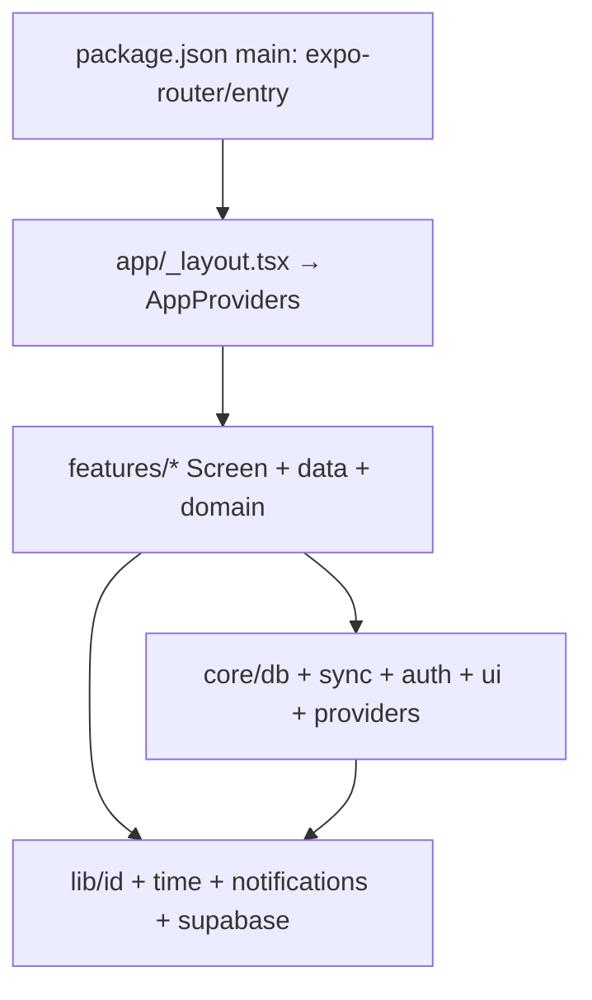

# 00_INDEX.md

**Knowledge-base location:** `docs/knowledge-base/`. **Master summary:** [KNOWLEDGE_BASE.md](./KNOWLEDGE_BASE.md).

---

## Repository identity

| Attribute | Value |
|-----------|--------|
| **Name** | `superhabits` (npm package, private) |
| **Purpose** | Offline-first Expo + React Native client; five modules: todos, habits, pomodoro, workout, calories |
| **Entry** | `package.json` → `"main": "expo-router/entry"` |
| **Schema version (stored)** | `4` (`app_meta.db_schema_version`) |
| **Next migration** | `5` (new `if (version < 5)` block in `core/db/client.ts` → `runMigrations`) |

---

## Top-level directory map

| Path | Role |
|------|------|
| `app/` | Expo Router routes: root layout, index redirect, `(tabs)` layout + thin tab route files |
| `assets/` | Icons, splash, favicon (referenced from `app.json`) |
| `core/` | DB singleton, types, sync engine, guest profile, `AppProviders`, PWA registration, shared `ui/` |
| `features/` | Feature modules: `{name}.data.ts`, `{name}Screen.tsx`, optional `{name}.domain.ts`, `types.ts` re-exports |
| `lib/` | `id`, `time`, `notifications`, `supabase` (remote stub) |
| `public/` | Web static assets; `sw.js` service worker |
| `tests/` | Vitest unit tests (domain-focused; one skipped data stub) |
| `patches/` | `patch-package` overrides for `node_modules` |
| `.github/workflows/` | CI (`ci.yml`) |
| `.devcontainer/` | VS Code Dev Container (Node image, port 8081) |
| `.cursor/` | Rules, agents, commands, skills (not modified by KB; described in [06_EDITOR_AND_DOCS.md](./06_EDITOR_AND_DOCS.md)) |

**Not present:** Backend API server, Docker deploy config, monorepo workspaces, root `CODEBASE_KNOWLEDGE.md` (verify if added later).

---

## Cross-feature interaction map

### `toDateKey()` (`lib/time.ts`)

| Consumer | Call pattern | Column / effect |
|----------|--------------|-----------------|
| `features/habits/habits.data.ts` | Default arg on `incrementHabit`, `decrementHabit`, `getHabitCountByDate` | `habit_completions.date_key` |
| `features/calories/calories.data.ts` | Default on `listCalorieEntries`; `addCalorieEntry` uses `input.consumedOn ?? toDateKey()` | `calorie_entries.consumed_on` |

**No other features** call `toDateKey()` directly. Habits UI does not pass a custom date — always “today” per helper defaults.

### `syncEngine.enqueue()` (`core/sync/sync.engine.ts`)

| File | Entity string | Operations | Notes |
|------|-----------------|------------|--------|
| `features/todos/todos.data.ts` | `todos` | create, update, delete | After every mutating write |
| `features/habits/habits.data.ts` | `habits` | create, update, delete | Completions **not** enqueued |
| `features/calories/calories.data.ts` | `calorie_entries` | create, delete | |
| `features/workout/workout.data.ts` | `workout_routines` | create, delete | `completeRoutine` (logs) **not** enqueued |

**Intentionally not synced:** `pomodoro_sessions`, `workout_logs`, `habit_completions` (per project rules).

### `useFocusEffect` (expo-router)

| Screen | Purpose |
|--------|---------|
| `TodosScreen` | `listTodos` → `setItems` on tab focus |
| `HabitsScreen` | `refresh` (habits + completion map) |
| `WorkoutScreen` | `refresh` (routines + logs) |
| `CaloriesScreen` | `refresh` (entries for current date key) |

**Not used:** `PomodoroScreen` (history loaded via `useEffect` on `historyVersion` only).

### Type imports: `core/db/types` vs feature `types.ts`

| Feature | `types.ts` |
|---------|------------|
| todos | `export type { Todo } from "@/core/db/types"` |
| habits | Re-exports `Habit`, `HabitCategory`, `HabitIcon` |
| pomodoro | Re-exports `PomodoroSession` |
| workout | Re-exports `WorkoutLog`, `WorkoutRoutine` |
| calories | Re-exports `CalorieEntry`; local `MealType`, `CalorieEntryTotals` |

Screens import `./types` or `@/core/db/types` depending on file; semantics align with SQLite rows.

---

## Tech stack (pinned)

| Layer | Choices |
|-------|---------|
| **Framework** | Expo SDK ~55, React 19, React Native 0.83, TypeScript 5.9 strict |
| **Navigation** | expo-router (file routes), `expo-router/ui` for custom tabs |
| **DB** | expo-sqlite; WAL on native (`PRAGMA journal_mode = WAL`), omitted on web bootstrap |
| **Styling** | NativeWind 4 + Tailwind 3; `global.css` → `nativewind/metro` |
| **Lists** | `@shopify/flash-list` 2.x (Todos only) |
| **Testing** | Vitest 3, Node environment, `@/` alias |
| **PWA (web)** | `workbox-window` registers `public/sw.js` |

**CI Node:** 20 (`.github/workflows/ci.yml`). **Devcontainer Node:** 22 image (`.devcontainer/devcontainer.json`) — intentional mismatch with CI.

---

## Dependency inventory (from `package.json`)

Legend: **Active** = imported from app/library source; **Dormant** = installed per rules but no feature hooks; **Unused** = no `import` found in `*.ts` / `*.tsx` at KB write time.

### `dependencies`

| Package | Version | Role | Import locus / verdict |
|---------|---------|------|-------------------------|
| `@expo/vector-icons` | ^15.0.2 | Material icons in tabs, screens, habit circles | Active |
| `@react-native-community/netinfo` | 11.5.2 | `NetInfo.addEventListener` in `AppProviders` → flush sync when online | Active |
| `@shopify/flash-list` | 2.0.2 | `TodosScreen` list | Active |
| `@tanstack/react-query` | ^5.90.21 | `QueryClient` + `QueryClientProvider` in `AppProviders` | **Wired; dormant** (no `useQuery` / `useMutation` in features) |
| `date-fns` | ^4.1.0 | — | **Declared; unused** in source |
| `expo` | ~55.0.5 | SDK | Active (transitive) |
| `expo-background-fetch` | ^55.0.9 | — | **Declared; unused** |
| `expo-file-system` | ^55.0.10 | — | **Declared; unused** in `*.ts`/`*.tsx` |
| `expo-notifications` | ^55.0.11 | `lib/notifications.ts` | Active |
| `expo-router` | ^55.0.4 | Routes, `Redirect`, `useFocusEffect`, `Tabs`/`TabTrigger`/`TabSlot` | Active |
| `expo-sqlite` | ^55.0.10 | `core/db/client.ts` | Active |
| `expo-status-bar` | ~55.0.4 | `app/_layout.tsx` | Active |
| `expo-task-manager` | ^55.0.9 | — | **Declared; unused** |
| `nativewind` | ^4.2.2 | Babel preset + Metro `withNativeWind` | Active (tooling) |
| `react` / `react-dom` | 19.2.0 | UI | Active |
| `react-native` | 0.83.2 | UI | Active |
| `react-native-gesture-handler` | ^2.30.0 | `ScrollView` in `Screen`, `Pressable` in `Button`, `GestureHandlerRootView` | Active |
| `react-native-reanimated` | 4.2.1 | Babel plugin | Active (tooling) |
| `react-native-safe-area-context` | ~5.6.2 | Transitive / Expo | Active |
| `react-native-screens` | ~4.23.0 | Expo Router stack | Active |
| `react-native-svg` | 15.15.3 | `ProgressRing.tsx` | Active |
| `react-native-web` | ^0.21.0 | Web target | Active |
| `tailwindcss` | ^3.4.19 | Tailwind binary for NativeWind | Active (tooling) |
| `uuid` | ^13.0.0 | — | **Declared; unverified** — IDs use `lib/id.ts` `createId`, not `uuid` |
| `workbox-window` | ^7.4.0 | `registerServiceWorker.ts` | Active (web only) |
| `zustand` | ^5.0.11 | — | **Declared; dormant** |

### `devDependencies`

| Package | Version | Role |
|---------|---------|------|
| `@expo/metro-runtime` | ~55.0.6 | Metro / Expo web |
| `@types/react` | ~19.2.2 | TypeScript types |
| `babel-preset-expo` | ^55.0.10 | `babel.config.js` |
| `cross-env` | ^10.1.0 | `EXPO_UNSTABLE_HEADLESS=1` for `npm run web` |
| `patch-package` | ^8.0.1 | `postinstall`; applies `patches/*` |
| `typescript` | ~5.9.2 | `tsc` |
| `vitest` | ^3.2.4 | `npm test` |

---

## Internal module dependency (summary)

---

## Documentation order (reference)

1. [01_APP_ROUTING.md](./01_APP_ROUTING.md) — routes and tab shell  
2. [02_CORE_INFRA.md](./02_CORE_INFRA.md) — DB, sync, providers, UI kit  
3. [03_LIB_SHARED.md](./03_LIB_SHARED.md) — shared libraries  
4. [04_FEATURES.md](./04_FEATURES.md) — feature modules  
5. [05_QA_AND_TOOLING.md](./05_QA_AND_TOOLING.md) — tests, CI, configs, SW, patches  
6. [06_EDITOR_AND_DOCS.md](./06_EDITOR_AND_DOCS.md) — Cursor assets, README  

---

## Discovery notes

- **`.env`:** not committed; `.gitignore` may ignore `.env*.local`.  
- **HTTP API:** none in repo.  
- **`schema.sql`:** reference only; runtime DDL is `bootstrapStatements` + `runMigrations` in `core/db/client.ts`.
