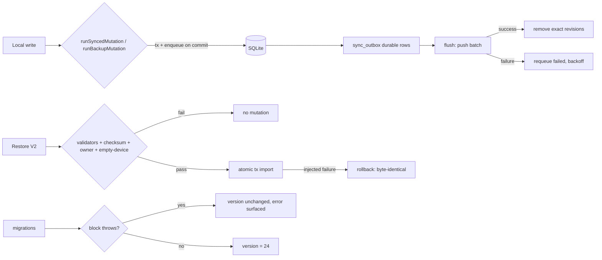

# Design: Production Hardening V1

## Context

Predecessor campaigns left a green, clean tree at `ac0d9b2` with strong
baseline gates (typecheck 0, lint 0, Vitest 1892/1892, P0 25/25, web:verify
PASS, hygiene PASS). This campaign targets the persistence/recovery layer
beneath that polish.

## Goals / Non-Goals

**Goals:**

1. Root-cause and close the baseline restore-tombstone parallel-load flake.
2. Prove migration failure-path safety and historical upgrade paths.
3. Prove duplicate-write safety across all sibling write families.
4. Extend restore disaster-recovery evidence (malformed, atomicity, owner).
5. Extend offline/reconnect outbox evidence (restart, flapping, ordering).
6. Exercise the native lane on the available API-36 emulator with provenance.

**Non-Goals:** domain semantics changes; schema redesign; new product
surfaces; performance-framework introduction; production Supabase access.

## Decisions

### D1 — Flake investigation protocol (CG-9 style)

The failing test `restore.coordinator > blocks restore when local synced
tables contain tombstones` failed once under full parallel load and passed
in isolation and on full re-run. Approach:

1. Reproduce under load: repeated full `qa:fast` runs (up to 8) capturing
   full logs; if unreproducible, run the file under artificial CPU load
   (`--maxWorkers` stress) to widen the timing window.
2. Read the test + `restore.coordinator.ts` emptiness check for unawaited
   async chains, shared fixture state, or revision-dependent ordering.
3. Fix the mechanism, not the symptom. Add no retries.
4. Validate with the WM2.4 battery: 8 consecutive clean full-parallel runs.

### D2 — Migration failure-path test via injected failure

`core/db/client.ts` `runMigrations()` runs blocks sequentially. The test
injects a throwing migration callback (via a test-only seam or by
constructing a DB at a stored version whose next block fails on malformed
data) and asserts: (a) the error propagates, (b) `app_meta.db_schema_version`
still holds the old version, (c) a subsequent open with fixed data succeeds
and advances exactly to the current version. Append-only policy is audited by
reading, not by editing, historical blocks.

### D3 — Historical upgrade fixtures from runtime migration truth

Fixtures construct a DB at an older stored version using the same runtime
DDL paths (bootstrap + truncated migration history), insert representative
rows, then run the full migration chain. Versions chosen: a minimal old
version (pre-planning), the pre-Gym V2 version (21), and version 23 (one
behind current). Assertions: row preservation (ids/timestamps), new columns'
defaults, index existence (`sqlite_master`), final version == 24.

### D4 — Duplicate-write probes at the data-layer boundary

Rapid double-invocation of each write function (concurrent `Promise.all`
plus sequential double-call) against the integration SQLite fixture:
`addTodo`, `toggleTodoComplete`, `incrementHabitCompletion`,
`addCalorieEntry`, `createSavedMeal`, `completePomodoroSession`,
workout set logging, `createProject`, `createGoal`. Classification:
intentionally-repeatable (e.g., habit increment is count+1 by design),
idempotent (same id upsert), or vulnerable (duplicate rows). Vulnerable
paths get a root fix (submit-guard at UI + unique constraint/claim at data
layer where the schema permits) plus regression tests.

### D5 — Restore DR matrix reuses existing validators + injected import failures

Malformed-payload tests feed mutated backup payloads (checksum tamper, owner
swap, scope downgrade, truncated arrays, duplicate ids) into the Restore V2
preview/import path and assert pre-import rejection with classified errors.
Atomicity: inject a failure mid-import (make one importer throw on the Nth
row) and assert the DB is byte-identical to pre-restore state (transaction
rollback), `db_schema_version` untouched, no outbox rows added.

### D6 — Outbox torture via fake timers + adapter stubs

Offline/restart: enqueue N mutations with a failing adapter, close/reopen
the DB (new `getDatabase()` after reset), assert outbox rows survive and
hydrate. Flapping: alternate adapter success/failure across cycles with
concurrent flush calls (interval + visibility + reconnect simulation),
assert no duplicate pushes per (entity,id,revision), no lost records,
sane `nextRetryAt` backoff.

### D7 — Native lane: provision on CRBABot_API_36 or Nitro_API_36

`npm run qa:native:provision` builds the credential-free e2e-test APK and
records provenance (package/source). Then `qa:native:smoke`/targeted
persistence flows per `docs/testing/autonomous-qa.md`. Any ENVIRONMENT
blocker is reported as such, never as a pass.

## Mermaid — restore/migration risk map

## Open Questions

- None blocking. If the flake mechanism proves to be Vitest worker
  contention beyond repository control, the fallback is isolating the file
  into its own project with evidence — not retries.
